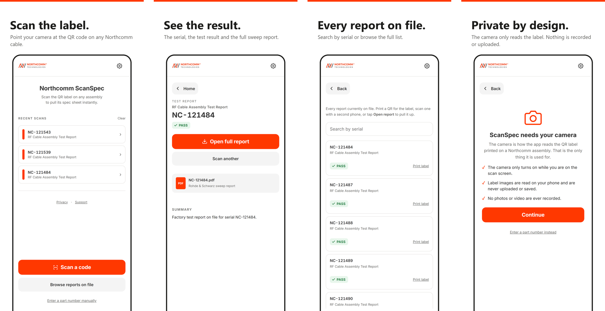
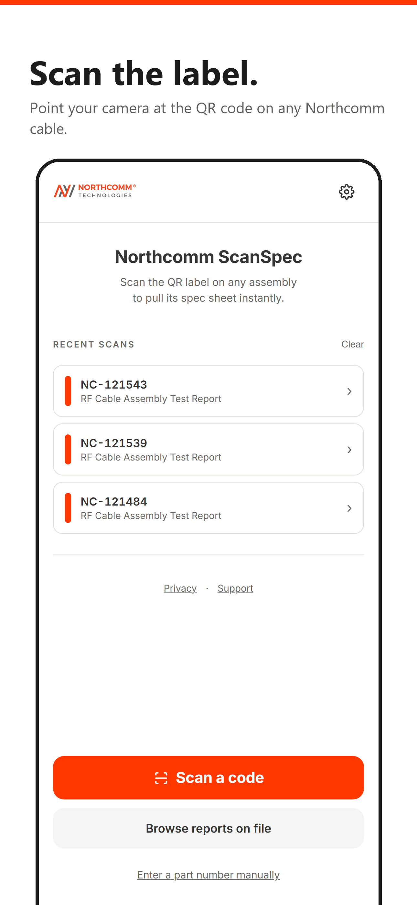
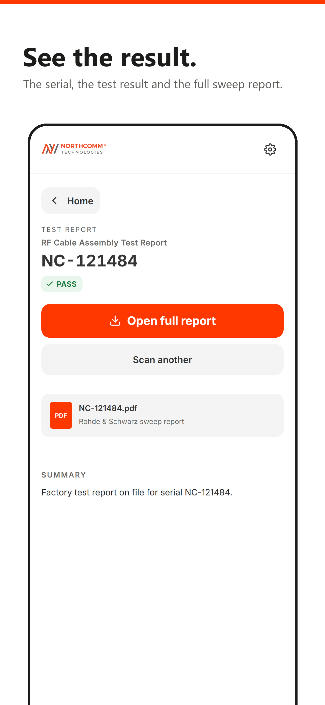
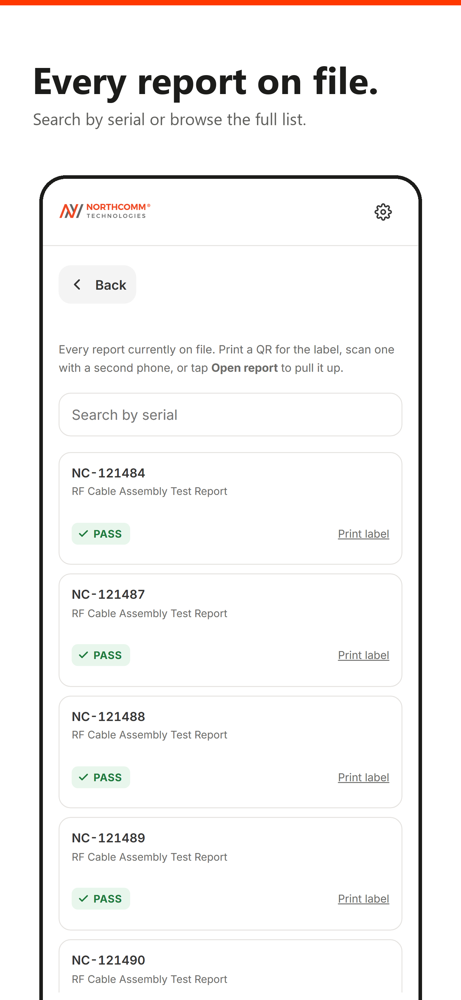
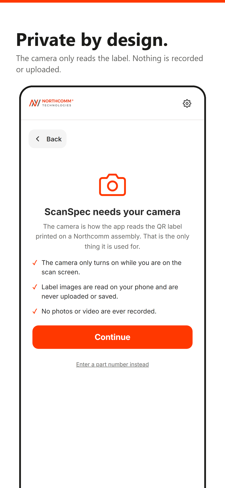

# Northcomm ScanSpec: App Store preview images

Four preview images for the App Store listing. Each is **1290 x 2796 px** (Apple's 6.9 inch iPhone size), PNG, no transparency. Upload them in this order.

| 1. Scan the label | 2. See the result | 3. Every report on file | 4. Private by design |
|:---:|:---:|:---:|:---:|
|  |  |  |  |
| [01-home.png](01-home.png) | [02-report.png](02-report.png) | [03-browse.png](03-browse.png) | [04-camera.png](04-camera.png) |

## How to download
Click a file name above, then the download button (arrow icon) on the right. Or grab everything at once: green **Code** button, then **Download ZIP**.

## Notes
- Brand orange is `#FF3800`, the same as the Northcomm logo.
- Every serial number, report title and PASS result shown is a real report on file.
- `raw/` holds the plain screenshots without captions, plus a Settings screen, in case a different layout is wanted.
- The app: https://northcomm-tech.github.io/Northcomm.app/
- The spec lookup site: https://northcommtechspecs.com
